<!-- ========================= HERO ========================= -->

 

Incoming Computer Science Ph.D. student at **Iowa State University**, building practical systems at the intersection of machine learning, compilers, and software infrastructure.

  

 

 

<!-- ========================= ABOUT ========================= -->

## `01.` ABOUT ME

<table>
<tr>
<td width="50%" valign="top">

### 🔬 Research

Building **MLIRBench**, a benchmark for evaluating whether large language models can reason correctly about the semantics of MLIR programs.

My interests include:

- ML systems and infrastructure
- LLM-guided compiler optimization
- AI agents for program analysis
- Intermediate representations
- RISC-V and downstream architectures

</td>
<td width="50%" valign="top">

### ⚡ Engineering

I enjoy transforming ambitious research ideas into complete, measurable, and usable systems.

Beyond research, I work across:

- Full-stack application development
- Cloud and developer infrastructure
- Data pipelines and automation
- AI-powered developer tools
- Open-source research tooling

</td>
</tr>
</table>

> **I am interested in systems where AI does more than generate text. It analyzes programs, uses tools, validates its decisions, and improves real software.**

 

<!-- ========================= CURRENT EXPLORATIONS ========================= -->

## `02.` CURRENTLY EXPLORING

<table>
<tr>
<td width="50%" valign="top">

### Compiler Intelligence

- MLIR and IREE
- LLM semantic reasoning
- Compiler optimization
- Agentic program analysis

</td>
<td width="50%" valign="top">

### Systems and Infrastructure

- RISC-V architectures
- AI infrastructure
- Distributed systems
- Execution-grounded evaluation

</td>
</tr>
</table>

---

## `03.` TECHNOLOGY ARSENAL

### Core Languages

  

### AI, Data, and Research

  

  

### Web, Backend, and Databases

  

### Cloud and Infrastructure

  

### Engineering Tools

 

<b>View the complete technical stack</b>

 

| Area | Technologies |
|---|---|
| Languages | Python, Java, Kotlin, JavaScript, HTML, CSS, LaTeX, Markdown |
| Compiler and Systems | MLIR, IREE, CUDA, RISC-V |
| AI and Data | PyTorch, TensorFlow, Keras, scikit-learn, NumPy, Pandas, Matplotlib |
| Web and Backend | React, Node.js, Express, FastAPI |
| Databases | PostgreSQL, Supabase, MongoDB, MySQL, Firebase, DynamoDB, Neo4j |
| Infrastructure | Docker, AWS, Google Cloud, Terraform, Vercel, GitHub Actions, GitLab CI |
| Engineering Tools | Git, GitHub, GitLab, Postman, Jira, Figma, Notion, Splunk |

<!-- ========================= EXPERIENCE ========================= -->
## `04.` EXPERIENCE HIGHLIGHTS
<table> <tr> <td align="center" width="33%">
🎓 Research

ML systems, compiler reasoning, benchmarks, LLM evaluation, and intelligent optimization workflows.

</td> <td align="center" width="33%">
💻 Industry

Software engineering experience involving cloud systems, security infrastructure, full-stack development, and production tooling.

</td> <td align="center" width="33%">
🧑‍🏫 Teaching

Experience teaching computer science, mentoring students, developing technical curricula, and explaining complex systems clearly.

</td> </tr> </table>   

<!-- ========================= ANALYTICS ========================= -->
## `05.` GITHUB ANALYTICS

 

 

## `06.` CONTRIBUTION ACTIVITY

  
   <!-- ========================= CONNECT ========================= -->

## `07.` LET'S CONNECT

I am always interested in conversations around ML systems, compiler optimization, intelligent developer tools, research collaborations, and ambitious engineering projects.

 
  

Building intelligent systems that can reason, execute, validate, and improve.
 

